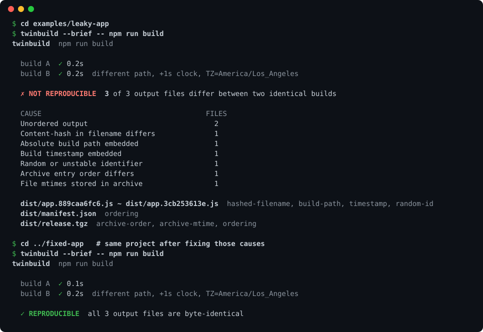
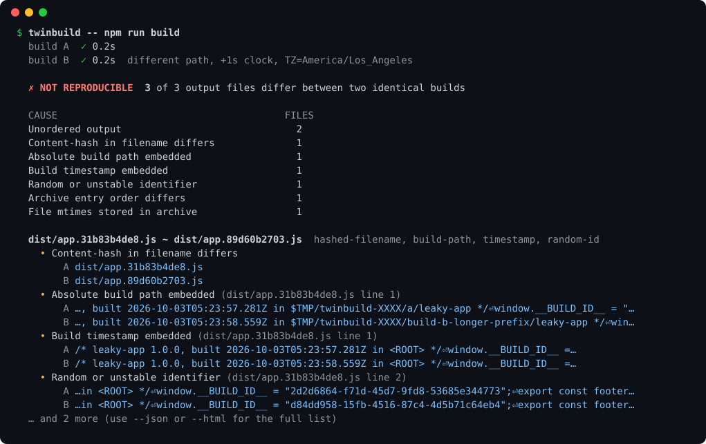
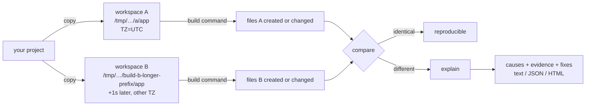

<div align="center">

# twinbuild

**Build your project twice, in two clean copies, and find out exactly why the outputs differ.**

[](https://github.com/Nithinfgs/twinbuild/actions/workflows/ci.yml)
[](LICENSE)
[](package.json)
[](package.json)



</div>

## In 20 seconds

If a build is deterministic, building it twice gives byte-identical files. When it isn't, you get cache misses in Turborepo/Nx/Bazel/Docker, artifacts nobody can verify, and noisy diffs in release PRs.

`twinbuild` runs your build command in **two fresh copies of your project** (different directory, different clock, different time zone), compares everything the build produced, and for each difference tells you **which kind of non-determinism caused it** and how to fix it:

- an absolute build path baked into a bundle
- a timestamp (ISO, epoch, `__DATE__`/`__TIME__`)
- a random UUID or unstable hash
- keys, lines or archive entries in a different order
- mtimes, owners and gzip headers inside `.tgz` / `.zip` / `.jar` / `.whl`
- content-hashed filenames that change because their contents did

It works with any build command in any language, because it only looks at the files the build writes. No dependencies, no network, no config.

## Quick start

```bash
# in your project directory
npx github:Nithinfgs/twinbuild -- npm run build
```

Anything after `--` is your build command: `make`, `cargo build --release`, `go build ./...`, `npm pack`, `python -m build`, `./gradlew assemble`, ...

Try it on the bundled demos first:

```bash
git clone https://github.com/Nithinfgs/twinbuild && cd twinbuild
cd examples/leaky-app && node ../../bin/twinbuild.js -- npm run build   # exit code 1, 7 causes
cd ../fixed-app       && node ../../bin/twinbuild.js -- npm run build   # exit code 0
```

Exit codes: `0` reproducible, `1` outputs differ, `2` error (for example the build itself failed), so it drops straight into CI.

## Example

Full output for the leaky demo project (excerpt):



Each cause is shown with the actual text from build A and build B, so you can grep your build for it.

## Why this exists

Reproducible-build tooling already exists ([diffoscope](https://diffoscope.org/), [reprotest](https://salsa.debian.org/reproducible-builds/reprotest)), and it is excellent, but it is aimed at distribution maintainers: heavy to install, and it shows *what* differs rather than *why*. Most application developers just want to know whether their `npm run build` is stable and, if not, which line of their build to fix.

`twinbuild` is that smaller tool. It is not a replacement for diffoscope; for a deep binary diff, use `--keep` and hand the two kept workspaces to it.

## Usage

```text
twinbuild [options] -- <build command>

  --out <dir>             Only compare files under <dir> (repeatable). Default: every
                          file the build creates or modifies.
  --ignore <glob>         Ignore matching paths when finding outputs (repeatable).
  --exclude <glob>        Do not copy matching paths into the workspaces (repeatable).
  --tz <zone>             Time zone for build B (default America/Los_Angeles, 'same' to disable).
  --source-date-epoch     Set SOURCE_DATE_EPOCH to the same value in both builds.
  --timeout <seconds>     Kill a build after this long (default 900).
  --max-files <n>         Show details for at most <n> differing files (default 12).
  --brief                 Only print the verdict, causes and affected files.
  --json                  Print the full result as JSON.
  --html <file>           Also write a standalone HTML report.
  --show-build-output     Stream build output to stderr.
  --keep                  Keep the temporary workspaces for inspection.
```

Useful recipes:

```bash
# Does my toolchain honour SOURCE_DATE_EPOCH? Compare against a plain run.
twinbuild --source-date-epoch -- npm run build

# Only care about the release artifact
twinbuild --out dist -- npm run build

# Verify the tarball you would publish
twinbuild -- npm pack

# Skip huge dependency folders when copying (they are not needed by every build)
twinbuild --exclude target --exclude .venv -- make

# CI gate with an HTML artifact
twinbuild --html twinbuild-report.html -- npm run build
```

### In GitHub Actions

```yaml
- uses: actions/checkout@v4
- uses: actions/setup-node@v4
  with: { node-version: 22 }
- run: npm ci
- run: npx github:Nithinfgs/twinbuild --html twinbuild-report.html -- npm run build
- uses: actions/upload-artifact@v4
  if: failure()
  with: { name: twinbuild-report, path: twinbuild-report.html }
```

## How it works



1. **Copy** the project twice (without `.git`), preserving timestamps and relative symlinks. Directory names differ in length on purpose.
2. **Build** in A, wait at least a second, then build in B with a different time zone. Nothing else is varied by default, so every difference is a real problem in your build, not a contrived one.
3. **Find outputs** by stat-ing every file before and after the build: whatever is new or rewritten is an output (`node_modules` and `.git` are ignored).
4. **Pair** files by path; files whose names differ only by a content hash (`app.3f9a1c.js` / `app.b72e00.js`) are paired too.
5. **Explain** each differing pair by normalising one kind of noise at a time (paths, then timestamps, then UUIDs/hashes) and checking whether that makes the files equal. A cause is only reported if the two builds disagree on it, so a fixed `2020-01-01` date is not a finding. Archives are unpacked and each entry is analysed, along with order, mtimes, owners and gzip headers.

Anything that survives all of this is reported as *unclassified* with the first differing bytes, rather than guessed at.

## Use cases

- **Fix cache misses**: remote caches key on output hashes of upstream tasks; one timestamp invalidates everything downstream.
- **Supply-chain hygiene**: an artifact that cannot be rebuilt to the same bytes cannot be independently verified.
- **Release engineering**: gate `npm pack` / wheel / jar output so it never changes without a code change.
- **Review confidence**: confirm that a toolchain upgrade or a refactor did not change what gets shipped.
- **Teaching**: `examples/leaky-app` is a compact catalogue of the usual mistakes.

## Limitations

Please read these before trusting a green result.

- **A pass means "stable under the conditions varied"**: path, wall clock and time zone. It does not vary user, locale, CPU count, filesystem ordering, environment variables or the machine. Reproducible here is not proof of reproducible everywhere.
- Cause detection is **heuristic** (patterns plus normalise-and-compare). It can miss formats and occasionally attribute a difference to a neighbouring cause. The evidence shown is always the raw text, so you can judge for yourself.
- The build must succeed in a **copy** of the project, with the same network and tools. Builds that download things can differ for reasons twinbuild cannot see.
- Copying large dependency trees takes time; use `--exclude` for what the build does not need. Copies use copy-on-write where the filesystem supports it.
- Docker/OCI images are not analysed (the files a build writes are). Windows is untested; CI runs on Linux and macOS.
- Files over 32 MB are compared by hash only.

## Programmatic API

```js
import { twinBuild } from 'twinbuild';

const result = await twinBuild({ command: 'npm run build', out: ['dist'] });
if (!result.reproducible) console.log(result.causes);
```

## Roadmap

- [ ] `--runs N`: build more than twice to catch rare, timing-dependent differences
- [ ] More variations behind flags: locale, user, umask, CPU count
- [ ] Wasm and `.jar` class-file specific explainers (build ids, constant-pool ordering)
- [ ] A first-party GitHub Action with a PR comment summary
- [ ] SARIF output for code-scanning annotations
- [ ] Publish to npm

Ideas and bug reports are welcome: see [CONTRIBUTING.md](CONTRIBUTING.md). A great first contribution is a new explainer for a toolchain you know (the fixtures are tiny).

## Contributing

```bash
git clone https://github.com/Nithinfgs/twinbuild && cd twinbuild
npm install
npm run check    # biome lint, tsc type-check, node:test
```

See [CONTRIBUTING.md](CONTRIBUTING.md) and [docs/how-it-works.md](docs/how-it-works.md).

## License

[MIT](LICENSE)
